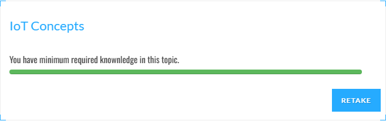
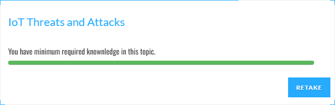
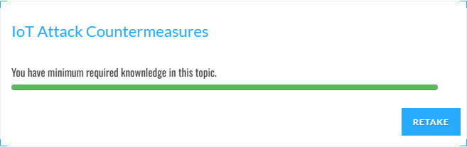
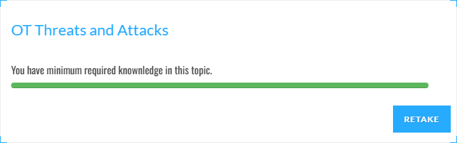
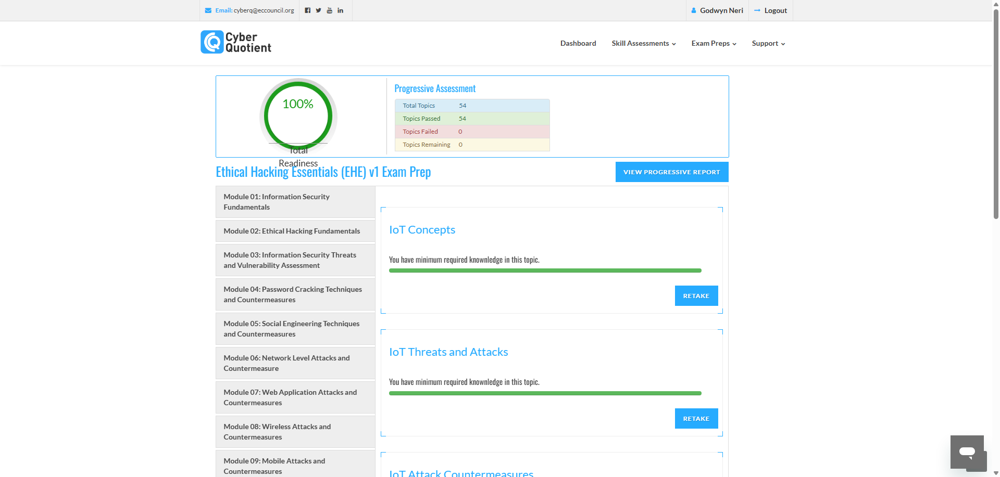
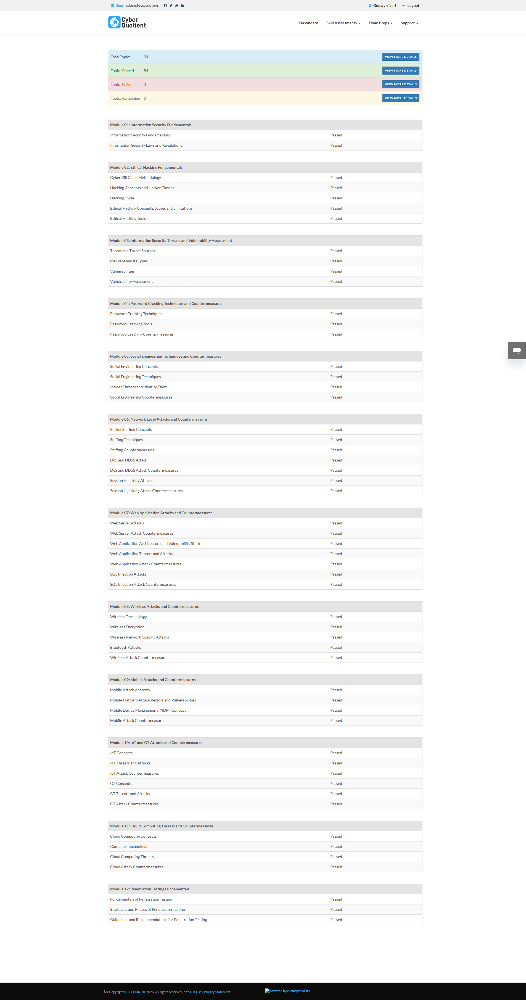

**Course Code: Information Assurance and Security (Data Privacy) - SY2627-1T**

**04 Performance Task 2: CyberQ Exam Preparation (Module 10)**

*Student:* Godwyn Neri | *Date:* October 3, 2026

---

### Direction
Accomplish the following Exam Preparation tests for Module 10 on EC-Council Cyber Quotient:
- Module 10: IoT and OT Attacks and Countermeasures
  - IoT Concepts
  - IoT Threats and Attacks
  - IoT Attack Countermeasures
  - OT Concepts
  - OT Threats and Attacks
  - OT Attack Countermeasures
- Screenshot the 100% result of each test and compile in MS Word with proper labelling.
- Submit a PDF version to the Dropbox to finalize.

---

### Summary of Completed Assessments

| Module | Test Topic | Status | Score |
| :--- | :--- | :---: | :---: |
| Module 10 | IoT Concepts | [PASS] | 100% |
| Module 10 | IoT Threats and Attacks | [PASS] | 100% |
| Module 10 | IoT Attack Countermeasures | [PASS] | 100% |
| Module 10 | OT Concepts | [PASS] | 100% |
| Module 10 | OT Threats and Attacks | [PASS] | 100% |
| Module 10 | OT Attack Countermeasures | [PASS] | 100% |

---

### Part 1: Module 10 – IoT and OT Attacks and Countermeasures

#### Topic 1: IoT Concepts
Test covering what IoT devices are, how smart sensors and gadgets connect to the internet, and how they share operational data.

#### Topic 2: IoT Threats and Attacks
Test covering common weaknesses in smart devices, such as default factory passwords, unpatched firmware, and hacker botnets like Mirai.

#### Topic 3: IoT Attack Countermeasures
Test covering how to protect smart devices using strong passwords, encrypted connections, secure firmware updates, and network firewalls.

#### Topic 4: OT Concepts
Test covering Operational Technology (OT) basics, how factory computers (PLCs and SCADA) control physical machines, and the Purdue Model.

#### Topic 5: OT Threats and Attacks
Test covering attacks on industrial equipment, such as abusing old communication protocols (Modbus), network flooding (DoS), and data theft.

#### Topic 6: OT Attack Countermeasures
Test covering ways to secure industrial plants, including separate security zones (IDMZ), strict access controls, regular patching, and continuous monitoring.

---

### Part 2: Verified Progressive Assessment Report
Official progressive report from EC-Council Cyber Quotient verifying that all Module 10 topics have been successfully passed at 100% under student Godwyn Neri:

---

### Deliverable Files Generated
- **Microsoft Word Document:** `04_Performance_Task_2_Godwyn_Neri.docx`
- **Submission PDF:** `04_Performance_Task_2_Godwyn_Neri.pdf`
- **Screenshots:** Stored in `screenshots/` directory
