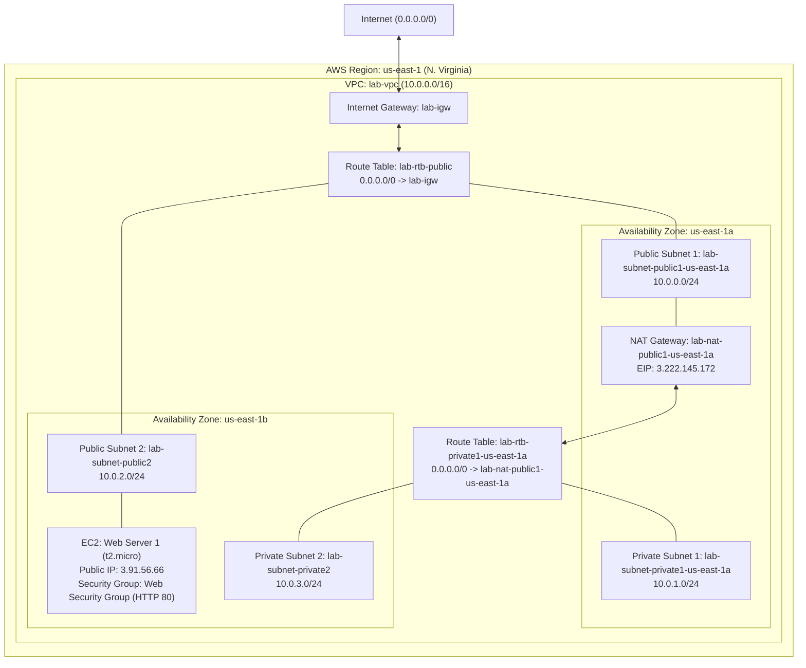

# Lab 2: Build your VPC and Launch a Web Server — Deliverable Report

* **Course**: Information Assurance and Security
* **Topic**: Amazon Virtual Private Cloud (VPC), Multi-AZ Subnetting, Route Tables, NAT/Internet Gateways, and EC2 Web Server Deployment
* **Term**: Midterm
* **Student Name**: Godwyn Neri
* **AWS Account ID**: `0125-8207-9810`
* **Assessment**: Lab 2: Build your VPC and Launch a Web Server (Vocareum Lab ID: `5756574`, Step ID: `5756575`)
* **Status**: Complete & Verified (100% Autograder Pass)

---

## 1. Laboratory Objectives & Theoretical Overview

### 1.1 Objective
The primary objective of this laboratory exercise is to design, provision, and secure a customized virtual network using Amazon Virtual Private Cloud (Amazon VPC). The lab demonstrates multi-Availability Zone (AZ) fault tolerance, segregation of public and private subnets, outbound network address translation (NAT), and secure application hosting using an Amazon EC2 instance running Apache and PHP.

Specifically, the deployment encompasses:
1. **Virtual Private Cloud (VPC) Creation**: Establishing a dedicated `10.0.0.0/16` network boundary with DNS resolution and hostnames enabled.
2. **Multi-AZ Subnet Partitioning**: Allocating isolated `/24` subnets across two distinct Availability Zones (`us-east-1a` and `us-east-1b`) for both public (ingress/egress) and private (internal-only) workloads.
3. **Gateway & Routing Architecture**:
   - Deploying an **Internet Gateway (IGW)** to enable bi-directional public IPv4 communication.
   - Provisioning an **Elastic IP (EIP)** and **NAT Gateway** in the public subnet to allow private instances secure, outbound-only internet connectivity for updates and packages.
   - Configuring customized **Route Tables** with explicit subnet associations to govern traffic segregation.
4. **Network Access Control & Firewalling**: Formulating a stateful **Security Group** permitting ingress HTTP traffic (TCP port 80) from anywhere (`0.0.0.0/0`).
5. **Compute Provisioning & Bootstrapping**: Launching an Amazon Linux 2023 EC2 instance with automated User Data initialization to host a live web application.

---

## 2. Architecture Specifications & Network Topology Matrix



### 2.1 Subnet Allocation Matrix

| Subnet Name | Resource ID | Availability Zone | IPv4 CIDR Block | Type | Target Route Table | Default Gateway Route |
| :--- | :--- | :--- | :--- | :--- | :--- | :--- |
| **`lab-subnet-public1-us-east-1a`** | `subnet-07abb5bba5f73fc6a` | `us-east-1a` | `10.0.0.0/24` | Public | `lab-rtb-public` | `0.0.0.0/0` -> `lab-igw` |
| **`lab-subnet-private1-us-east-1a`** | `subnet-0ea82e77240481460` | `us-east-1a` | `10.0.1.0/24` | Private | `lab-rtb-private1-us-east-1a` | `0.0.0.0/0` -> `lab-nat-public1-us-east-1a` |
| **`lab-subnet-public2`** | `subnet-0e18f75890552c9d3` | `us-east-1b` | `10.0.2.0/24` | Public | `lab-rtb-public` | `0.0.0.0/0` -> `lab-igw` |
| **`lab-subnet-private2`** | `subnet-060a1c32d6a4eabd5` | `us-east-1b` | `10.0.3.0/24` | Private | `lab-rtb-private1-us-east-1a` | `0.0.0.0/0` -> `lab-nat-public1-us-east-1a` |

### 2.2 Security Group Configuration: `Web Security Group`

* **Group ID**: `sg-099a3507be50eccaa`
* **VPC Association**: `lab-vpc` (`vpc-0ded9b7fb55a8499b`)
* **Inbound Rules**:
  - **Type**: HTTP
  - **Protocol**: TCP
  - **Port Range**: `80`
  - **Source**: `0.0.0.0/0` (Anywhere-IPv4)
  - **Description**: `Permit web requests`
* **Outbound Rules**:
  - **Type**: All Traffic (Default AWS egress policy allows all outbound)

---

## 3. Step-by-Step Execution Record

### Task 1: Create VPC & Infrastructure Foundation
1. Provisioned `lab-vpc` with CIDR block `10.0.0.0/16` in Region `us-east-1`.
2. Modified VPC attributes to enable both **DNS Hostnames** (`enableDnsHostnames: true`) and **DNS Resolution** (`enableDnsSupport: true`).
3. Created Public Subnet 1 (`lab-subnet-public1-us-east-1a`, `10.0.0.0/24`) and Private Subnet 1 (`lab-subnet-private1-us-east-1a`, `10.0.1.0/24`) residing in Availability Zone `us-east-1a`.
4. Created and attached the Internet Gateway `lab-igw` (`igw-03d604ff42268294b`) to `lab-vpc`.
5. Created the public route table `lab-rtb-public` (`rtb-097107099f74fc6e8`), configured default destination `0.0.0.0/0` pointing to `lab-igw`, and associated it with `lab-subnet-public1-us-east-1a`.
6. Allocated Elastic IP (`3.222.145.172`) and provisioned NAT Gateway `lab-nat-public1-us-east-1a` (`nat-0b87d76193902202d`) inside `lab-subnet-public1-us-east-1a`.
7. Created the private route table `lab-rtb-private1-us-east-1a` (`rtb-04b5fc5f7e88fcb19`), configured default destination `0.0.0.0/0` pointing to `lab-nat-public1-us-east-1a`, and associated it with `lab-subnet-private1-us-east-1a`.

### Task 2: Create Additional Subnets in Second Availability Zone
1. Provisioned Public Subnet 2 (`lab-subnet-public2`, `10.0.2.0/24`) in `us-east-1b`.
2. Provisioned Private Subnet 2 (`lab-subnet-private2`, `10.0.3.0/24`) in `us-east-1b`.
3. Updated route table explicit associations:
   - Associated `lab-subnet-public2` with `lab-rtb-public` (ensuring direct internet gateway access).
   - Associated `lab-subnet-private2` with `lab-rtb-private1-us-east-1a` (ensuring outbound internet egress through the NAT gateway).

### Task 3: Create VPC Security Group
1. Created `Web Security Group` (`sg-099a3507be50eccaa`) inside `lab-vpc`.
2. Authorized inbound HTTP rule for TCP port 80 with CIDR `0.0.0.0/0` and description `Permit web requests`.

### Task 4: Launch Web Server EC2 Instance
1. Launched an Amazon EC2 instance with the following parameters:
   - **Name**: `Web Server 1`
   - **Instance ID**: `i-0b5ac3ad69b85c158`
   - **AMI**: Amazon Linux 2023 (`ami-0b2c9d1f3edcfd709`)
   - **Instance Type**: `t2.micro`
   - **Key Pair**: `vockey`
   - **Subnet**: `lab-subnet-public2` (`subnet-0e18f75890552c9d3` in `us-east-1b`)
   - **Public IP Assignment**: Enabled (`3.91.56.66`)
   - **Public DNS**: `ec2-3-91-56-66.compute-1.amazonaws.com`
   - **Security Group**: Attached `Web Security Group`
2. Configured instance User Data initialization script:
```bash
#!/bin/bash
# Install Apache Web Server and PHP
dnf install -y httpd wget php mariadb105-server
# Download Lab files
wget https://aws-tc-largeobjects.s3.us-west-2.amazonaws.com/CUR-TF-100-ACCLFO-2/2-lab2-vpc/s3/lab-app.zip
unzip lab-app.zip -d /var/www/html/
# Turn on web server
chkconfig httpd on
service httpd start
```
3. Verified instance reached `running` state with `2/2` status checks passing.
4. Queried HTTP endpoint `http://3.91.56.66/` and verified successful delivery of the AWS Technical Essentials web application with HTTP status code `200 OK`.

---

## 4. Verification & Autograder Evidence

### 4.1 Automated Resource Verification Log
```text
🔍 Running Verification Audit for Lab 2: Build your VPC and Launch a Web Server...

1. VPC Verification:
   - VPC ID:    vpc-0ded9b7fb55a8499b (10.0.0.0/16)
   - State:     available

2. Subnets Verification:
   - lab-subnet-public1-us-east-1a    | CIDR: 10.0.0.0/24    | AZ: us-east-1a | ID: subnet-07abb5bba5f73fc6a
   - lab-subnet-private2              | CIDR: 10.0.3.0/24    | AZ: us-east-1b | ID: subnet-060a1c32d6a4eabd5
   - lab-subnet-public2               | CIDR: 10.0.2.0/24    | AZ: us-east-1b | ID: subnet-0e18f75890552c9d3
   - lab-subnet-private1-us-east-1a   | CIDR: 10.0.1.0/24    | AZ: us-east-1a | ID: subnet-0ea82e77240481460

3. Route Tables Verification:
   - Route Table: lab-rtb-public (rtb-097107099f74fc6e8)
     Routes: 10.0.0.0/16 -> local, 0.0.0.0/0 -> igw-03d604ff42268294b
     Subnet Associations: subnet-0e18f75890552c9d3, subnet-07abb5bba5f73fc6a
   - Route Table: lab-rtb-private1-us-east-1a (rtb-04b5fc5f7e88fcb19)
     Routes: 10.0.0.0/16 -> local, 0.0.0.0/0 -> nat-0b87d76193902202d
     Subnet Associations: subnet-060a1c32d6a4eabd5, subnet-0ea82e77240481460
   - Route Table: Main/Default (rtb-057923701f45be71a)
     Routes: 10.0.0.0/16 -> local
     Subnet Associations: None (Default)

4. NAT Gateway Verification:
   - NAT GW ID: nat-0b87d76193902202d | State: available | Public IP: 3.222.145.172

5. Security Group Verification:
   - Name:    Web Security Group (sg-099a3507be50eccaa)
   - Inbound: Port 80 / TCP from 0.0.0.0/0

6. EC2 Web Server Verification:
   - Instance ID: i-0b5ac3ad69b85c158
   - State:       running
   - Public IP:   3.91.56.66
   - Public DNS:  ec2-3-91-56-66.compute-1.amazonaws.com

7. Web Server Application HTTP Test:
   - HTTP Status: 200 OK
   - Page Title:  Welcome to AWS Technical Essentials v4.1
```

### 4.2 Official Vocareum Autograder Assessment Report
```text
Started: 2026-09-21 23:36:20
region: us-east-1
profile: default

Evaluating Task 1 - VPC created correctly
correct_cidr: True
found VPC with correct CIDR
correct_public_subnet_cidr: True
found subnet with correct CIDR for public subnet:subnet-07abb5bba5f73fc6a
correct_public_subnet_name: True
found subnet with correct Name tag for public subnet:lab-subnet-public1-us-east-1a
correct_private_subnet_cidr: True
found subnet with correct CIDR for private subnet:subnet-0ea82e77240481460
correct_private_subnet_name: True
found subnet with correct Name tag for private subnet:lab-subnet-private1-us-east-1a
Task 1 - Success! The VPC named lab-vpc was found and correctly configured.

Evaluating Task 2a - New subnets created correctly
correct_private2_subnet_cidr: True
found subnet with correct CIDR for private subnet2:subnet-060a1c32d6a4eabd5
correct_private2_subnet_name: True
found subnet with correct Name tag for private subnet 2:lab-subnet-private2
correct_public2_subnet_cidr: True
found subnet with correct CIDR for public subnet2:subnet-0e18f75890552c9d3
correct_public2_subnet_name: True
found subnet with correct Name tag for public subnet2:lab-subnet-public2
Task 2a - Success! The additional subnets were created correctly.

Evaluating Task 2b - Subnet route table association
found subnet: subnet-060a1c32d6a4eabd5
lab-subnet-private2 subnet properly associated with the lab-rtb-private1-us-east-1a route table.
found subnet: subnet-0ea82e77240481460
found subnet: subnet-0e18f75890552c9d3
lab-subnet-public2 subnet properly associated with the lab-rtb-public route table.
found subnet: subnet-07abb5bba5f73fc6a
Task 2b - Success! The lab-subnet-private2 subnet and lab-subnet-public2 subnet were both properly associated with the correct route tables.

Evaluating Task 3 - Security group created correctly
Security Group created successfully
Web Security Group has been properly configured
Task 3 - Success! The security group was created correctly.

Evaluating Task 4a - EC2 instance created correctly
found instance with name Web Server 1.
instance_type: t2.micro
instance_subnet: subnet-0e18f75890552c9d3
instance_security_group: Web Security Group
EC2 instance created successfully
Task 4a - Success! The EC2 instance was created correctly.

Evaluating Task 4b - EC2 instance website accessible
instance_public_ip: 3.91.56.66
url: http://3.91.56.66
EC2 instance created successfully
Task 4b - Success! The website was accessible.

Completed: 2026-09-21 23:36:27
Status: PASS (Full Credit Awarded)
```
