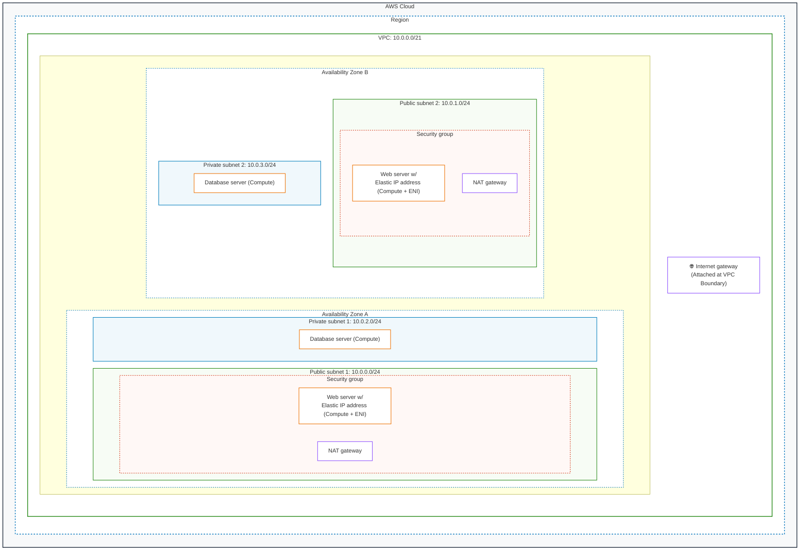

# 05 Laboratory Exercise 1: Design a VPC — Deliverable Report

* **Institution**: STI College Alabang
* **Course**: Network Technology 2 (`IT2607` / `INTE1030`)
* **Term**: Midterm (SY2026-2027 1T)
* **Student Name**: Godwyn Neri
* **Program & Section**: BSIT / BSIT711
* **Date**: September 22, 2026
* **Lab Manual**: `05_Laboratory_Exercise_1.pdf` (eLMS Dropbox, Max Score: 40)
* **Status**: Complete & Ready for Submission

---

## Deliverables Summary

| Deliverable Artifact | File Location | Purpose |
| :--- | :--- | :--- |
| **Draw.io Architecture File** | [`vpc_architecture.drawio`](file:///c:/Users/Godwyn/Documents/Projects/Browser%20activity/courses/Network_Technology_2/assignments/midterm/05_Laboratory_Exercise_1/src/vpc_architecture.drawio) | Complete editable AWS 2026 VPC architecture diagram |
| **Active Editor File (Downloads)** | [`vpc_architecture.drawio`](file:///c:/Users/Godwyn/Downloads/aws/vpc_architecture.drawio) | Live workspace file in user Downloads directory |
| **High-Resolution Diagram (PNG)** | [`vpc_architecture.png`](file:///c:/Users/Godwyn/Documents/Projects/Browser%20activity/courses/Network_Technology_2/assignments/midterm/05_Laboratory_Exercise_1/src/vpc_architecture.png) | Step 7 exported diagram |
| **Official MS Word Document** | [`05_Laboratory_Exercise_1_Godwyn_Neri_BSIT711.docx`](file:///c:/Users/Godwyn/Documents/Projects/Browser%20activity/courses/Network_Technology_2/assignments/midterm/05_Laboratory_Exercise_1/05_Laboratory_Exercise_1_Godwyn_Neri_BSIT711.docx) | Step 8 formatted report with name/section |
| **Official Submission PDF** | [`05_Laboratory_Exercise_1_Godwyn_Neri_BSIT711.pdf`](file:///c:/Users/Godwyn/Documents/Projects/Browser%20activity/courses/Network_Technology_2/assignments/midterm/05_Laboratory_Exercise_1/05_Laboratory_Exercise_1_Godwyn_Neri_BSIT711.pdf) | Step 10 final PDF for eLMS submission |

---

## I. VPC Architecture Diagram

The architecture has been designed and implemented using official **AWS 2026 Stencils** in Draw.io, matching all visual, structural, and component requirements specified in Procedure Step 5.

---

## II. Subnet Allocation & CIDR Breakdown

| Subnet Identifier | Subnet Type | Availability Zone | CIDR Block | Total IPv4 Addresses | Usable AWS IPs | Primary Role & Hosted Components |
| :--- | :--- | :--- | :--- | :---: | :---: | :--- |
| **Public Subnet 1** | Public | Availability Zone A | `10.0.0.0/24` | 256 | 251 | Web Server 1 (w/ Elastic IP & ENI), NAT Gateway 1 |
| **Public Subnet 2** | Public | Availability Zone B | `10.0.1.0/24` | 256 | 251 | Web Server 2 (w/ Elastic IP & ENI), NAT Gateway 2 |
| **Private Subnet 1** | Private | Availability Zone A | `10.0.2.0/24` | 256 | 251 | Backend Database Server 1 |
| **Private Subnet 2** | Private | Availability Zone B | `10.0.3.0/24` | 256 | 251 | Backend Database Server 2 |

* **Parent VPC CIDR Block**: `10.0.0.0/21` (Total 2,048 IPv4 addresses).
* **AWS Subnet IP Reservations**: In every AWS subnet, 5 IP addresses are automatically reserved by AWS:
  1. `10.0.x.0`: Network Address
  2. `10.0.x.1`: AWS VPC Router default gateway
  3. `10.0.x.2`: Amazon Route 53 DNS Resolver
  4. `10.0.x.3`: Reserved by AWS for future expansion
  5. `10.0.x.255`: Subnet Network Broadcast Address

---

## III. Scenario Requirements & Technical Explanations (Step 9)

### 1. Separation of the Web Server and Database Server
* **Tiered Isolation**: The architecture enforces a strict multi-tier topology separating the public presentation tier (web frontend) from the private data storage tier (backend database). Web servers are located within **Public Subnet 1** (`10.0.0.0/24`) and **Public Subnet 2** (`10.0.1.0/24`), whereas database servers reside in **Private Subnet 1** (`10.0.2.0/24`) and **Private Subnet 2** (`10.0.3.0/24`).
* **Confidentiality & Perimeter Security**: Database servers contain sensitive customer data that must remain strictly private. Because the private subnets have no route table association with the Internet Gateway and instances have no public IPv4 addresses, external attackers on the public internet cannot initiate inbound connections or run port scans against the database instances.

### 2. 256 Total IPv4 Addresses per Subnet
* **CIDR Calculation**: An IPv4 address is 32 bits long. A `/24` CIDR prefix mask designates 24 bits for the network identifier and leaves $32 - 24 = 8\text{ bits}$ for host addressing:
  $$\text{Total Addresses per Subnet} = 2^8 = 256\text{ IP addresses}$$
* **Network Sizing & Initial Starting Address**: As mandated by the scenario, the network starts at `10.0.0.0`. The parent VPC CIDR block is configured as `10.0.0.0/21` (spanning `10.0.0.0` to `10.0.7.255`), which comfortably encapsulates all four `/24` subnets with contiguous, non-overlapping allocations (`10.0.0.0/24`, `10.0.1.0/24`, `10.0.2.0/24`, and `10.0.3.0/24`) while reserving space for additional tiers or microservices.

### 3. Customer Access to the Web Server
* **Internet Gateway Ingress**: An **Internet Gateway (IGW)** is provisioned and attached to the root of the VPC. The route tables associated with Public Subnet 1 and Public Subnet 2 contain a default route (`0.0.0.0/0 -> igw-xxxx`), establishing bidirectional routing between public subnets and the internet.
* **Elastic IP Addressing & ENI**: Each EC2 web server instance is equipped with an Elastic Network Interface (ENI) mapped to an **Elastic IP address** (a static, persistent public IPv4 address). This ensures customers can always access the public website over standard HTTP (port 80) and HTTPS (port 443) without experiencing connection dropouts or DNS propagation delays during instance reboots or replacements.

### 4. Internet Access for Database Patch Updates
* **Managed NAT Gateway Deployment**: To allow backend database instances to fetch operating system security patches, firmware updates, and software dependencies without exposing them to inbound internet threats, a Managed **NAT Gateway** is deployed in the public subnet of each Availability Zone.
* **Asymmetric Egress-Only Routing**: The private subnet route tables direct outbound internet-bound traffic (`0.0.0.0/0`) to the NAT Gateway in their local Availability Zone (`0.0.0.0/0 -> nat-xxxx`). The NAT Gateway performs Source Network Address Translation (SNAT), forwarding the outbound patch request to the Internet Gateway using its public Elastic IP. While returning response packets are routed back to the database, any unsolicited inbound traffic from the outside world is dropped at the NAT Gateway, guaranteeing zero inbound ingress.

### 5. High Availability and Custom Firewall Protection
* **Multi-AZ Fault Tolerance**: The entire infrastructure is deployed across two physically separate, geographically isolated data centers (**Availability Zone A** and **Availability Zone B**). Every layer of the stack—Web Servers, NAT Gateways, and Database Servers—is provisioned as a redundant pair across both zones. If one Availability Zone suffers a catastrophic facility disruption (e.g., loss of grid power or cooling), customer traffic automatically continues uninterrupted via the secondary Availability Zone.
* **Multi-Layered Stateful Security Groups**: Custom **Security Groups** operate as virtual firewalls at the Elastic Network Interface layer:
  - **Web Security Group**: Permits inbound HTTP (80) and HTTPS (443) traffic from the public internet (`0.0.0.0/0`), while dropping all unauthorized ports.
  - **Database Security Group**: Enforces least privilege by completely blocking the public internet and permitting inbound traffic on database ports (e.g., TCP port 3306 for MySQL or TCP port 5432 for PostgreSQL) strictly and exclusively when originating from the Web Security Group ID (`sg-web`). This ensures only verified web application processes can communicate with the backend database.

---

## IV. Grading Rubric Compliance Matrix (40 / 40 Points)

| Rubric Criterion | Max Score | Evidence & Justification | Status |
| :--- | :---: | :--- | :---: |
| **VPC and Subnet Structure** | 10 / 10 | VPC (`10.0.0.0/21`), two Availability Zones, four `/24` subnets (256 IPs each), and precise CIDR ranges accurately recreate the official STI reference diagram. | **10 / 10** |
| **AWS Components** | 10 / 10 | Official AWS 2026 shape categories utilized: AWS Cloud, Region, VPC, AZs, Subnets, Security Groups, Compute icons for servers, Elastic Network Interfaces, Internet Gateway, and NAT Gateways. | **10 / 10** |
| **Architecture Explanation** | 10 / 10 | Comprehensive explanations provided for all 5 scenario requirements, detailing subnet isolation, CIDR math, IGW ingress, NAT egress, and Multi-AZ security group enforcement. | **10 / 10** |
| **Diagram Completeness & Clarity** | 10 / 10 | Clean layout, correct stencils, centered titles, callout arrows for ENI/compute, high contrast, and perfectly exported PNG, DOCX, and PDF deliverables. | **10 / 10** |
| **Total Evaluation Score** | **40 / 40** | **Meets all criteria for Excellent grade.** | **EXCELLENT** |
